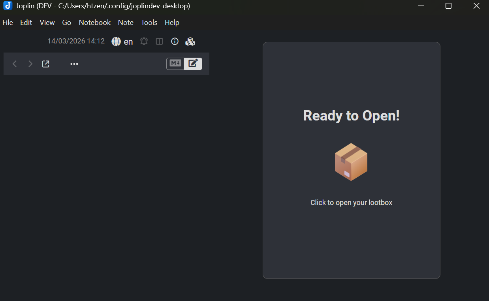

# Lootboxes

This [Joplin](https://joplinapp.org/) plugin provides a 'gamification' element for users who use to-do notes to track completion of tasks.

This app relies on Joplin's inherent synchronization capabilities to maintain the user's earned inventory state and lootbox progress across devices. Joplin's media caching also allows the user to easily access and view the multiple media files of their earned lootboxes.

## Features

- Modify the number of to-do notes to complete in order to earn a lootbox within the plugin settings menu. To-do notes will automatically be converted when the lootbox panel is opened, and when a synchronization event is completed.
    
- Customize the UI behavior on startup with the checkboxes in the plugin settings menu.
    
- Configure a custom keyboard shortcut to toggle the lootbox panel in the Joplin settings. By default this is `ctrl+3`
    

## Known Issues
- When a media element is clicked on and expanded into the magnified dialog view, if the user moves their cursor out of the dialog bounds and presses `esc` twice to close the dialog, the dialog will disappear but the Joplin application will freeze as if there is still a dialog covering the screen. This is avoided for now by clicking the 'close' button to exit from the dialog.

## Todo:
- add more sorting and view options for earned lootboxes
- enable functionality to specify subset of notebooks which are allowed to earn lootboxes, letting other sections function as normal
- see if plugin can work well on mobile
- investigate video element loading behavior
    - looks like Joplin implements native media caching that plays well with the content displayed in the lootbox panel. However, the video elements are often loaded as the blank media fallback element, only loading in when the mouseenter event is triggered...
        - perhaps the video preloading logic can be adjusted, or the caching logic can be adjusted to have these elements load in more smoothly.
- investigate why clicking out of the big dialog and pressing esc twice causes the application to freeze
- add more lootboxes
- determine if it's beneficial to add an optional caching setting for 'all lootboxes' so new lootboxes can be earned offline
- clean up the `verboseLogs` value in util.ts; make log messages more consistent in general

suggestions and feedback are welcome!